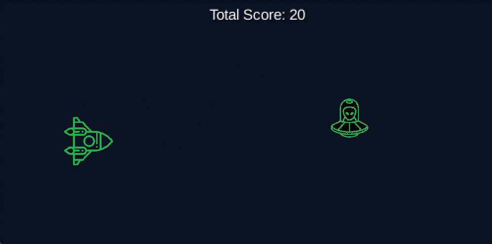

# Space Game

### Krótki opis projektu.

Projekt jest częścią pracy zaliczeniowej przedmiotu Technologie Obiektowe. 
Głównym celem projektu było praktyczne wykorzystanie wzorców projektowych w języku Java. Wybrane wzorce to Fasada, Fabryka Abstrakcyjna, Obserwator oraz Dekorator.



### Opis

Space Game to dynamiczna gra zręcznościowa, w której gracz wciela się w rolę pilota kosmicznego statku. 
Musi unikać przeszkód takich jak meteory i asteroidy oraz zestrzeliwać wrogie statki kosmiczne i kosmitów.

Głównym celem gry jest przetrwanie jak najdłużej i zdobycie jak największej ilości punktów. Gracz może zdobywać punkty 
poprzez zestrzeliwanie UFO i kosmitów, za co otrzymuje 10 punktów. Jednakże, trafienie w przeszkodę, taką jak meteor lub asteroida, 
spowoduje utratę 10 punktów. Przepuszczenie kosmity lub asteroidy powoduje utratę aż 50 punktów. Uderzenie w dowolną przeszkodę kończy grę i prowadzi do przegranej.

Sterowanie rakietą jest możliwe przy użyciu strzałek, które pozwalają na poruszanie się w różnych kierunkach, oraz klawisza spacji, który służy do strzelania.

### Wymagania
Java 8 lub nowsza

### Instrukcja uruchomienia
- Sklonuj repozytorium na swój lokalny komputer.
```
git clone https://github.com/sulowskikarol/SpaceGame.git
```
- Przejdź do katalogu projektu.
```
cd .\SpaceGame\
```
- Uruchom projekt.
```
./gradlew desktop:run
```

### Autor
Karol Sulowski - https://github.com/sulowskikarol
